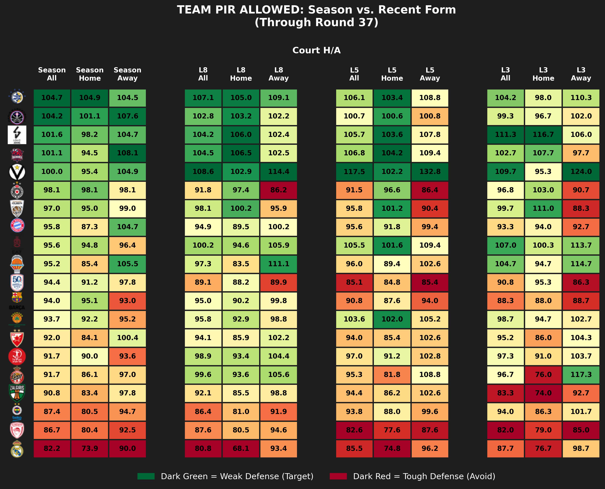

# EuroLeague Advanced Matchup & Analytics Dashboard

A Python-based data pipeline and visualization suite that extracts live EuroLeague boxscore data, processes advanced performance metrics, and generates analytics tables. 

## What It Does
This tool transforms raw, game-by-game boxscore data into actionable insights for Euroleague fantasy basketball or tactical analysis. It tracks how teams perform over different stretches of the season, identifies exactly which positions they struggle to defend, and measures the efficiency of their starters versus their bench players. Finally, it exports these insights as heatmap graphs.

## The Process 
Building this pipeline :
1. **Data Extraction & Cleaning:** Raw boxscore data is pulled via the EuroLeague API. Edge cases in the data (such as converting string time formats like "14:30" to decimals and safely handling "DNP", "INJ", or missing values) were standardized to prevent calculation errors.
2. **Custom Positional Mapping:** Because standard boxscores often lack accurate positional data, I integrated a custom mapping dictionary (`euroleague_players_to_map.csv`) to assign specific roles (PG, SG, SF, PF, C) to every player, allowing for deep matchup targeting.
3. **Advanced Aggregation:** The core takes Performance Index Rating (PIR) allowed and scored, but dynamically splits this data by Location (Home vs. Away) and Form (Season Average, Last 3, Last 5, Last 8 games).
4. **Master Visualization Engine:** Instead of styling charts one by one, I built a centralized master plotting function using `matplotlib` and `seaborn`. This handles dark-mode styling, automated color normalization, custom proxy legends, and dynamically scales official team logos on the Y-axis (including RGBA conversion to fix indexed image color glitches).

## Explanation of the Notebook (`pir_tables_extraction.ipynb`)
The entire project is driven by a single, highly organized Jupyter Notebook divided into distinct sections:
* **Section 1: Data Fetching & Caching.** Checks for a local CSV backup of the current round to save time and reduce API calls. If missing, it fetches new data, merges the positional mapping, and creates a new local backup.
* **Section 2: The Advanced Stats Engine.** Contains the `calculate_advanced_stats` function, which ranks games chronologically to separate recent form from season-long averages.
* **Section 3: The Master Plotting Function.** Houses `create_dark_heatmap`, the visual engine that standardizes the look of all graphics and inserts team logos.
* **Section 4: The Graph Generators.** Smaller wrapper functions (`generate_form_heatmap`, `generate_position_heatmap`, `generate_minutes_heatmap`) that format the data specifically for the master plotter.
* **Section 5: Execution Panel.** A clean, one-line execution block at the bottom of the notebook used to run the generators and save the final PNGs to the `outputs/` folder.

## What Every Graph Expresses

### 1. Team PIR Allowed (Form vs. Season)
* **What it shows:** How much Valuation (PIR) a team is giving up to their opponents, split by overall Season average, Last 8, Last 5, and Last 3 games. It further breaks these down by Home vs. Away games.
* **How to read it:** Dark Green indicates a weak defense (a great target for opposing offensive players). Dark Red indicates a tough defense (a matchup to avoid).

### 2. Team PIR Scored (Form vs. Season)
* **What it shows:** The offensive momentum of a team over the same time splits (Season, L8, L5, L3) and locations (Home/Away).
* **How to read it:** Dark Green indicates a highly productive offense. Dark Red indicates an offense currently struggling to generate PIR.

### 3. Position Matchup Analysis (5-Way & 3-Way)
* **What it shows:** A granular breakdown of a team's defensive weaknesses by specific position (Point Guard, Shooting Guard, Small Forward, Power Forward, Center) or by broader position groups (Guard, Forward, Center).
* **How to read it:** Dark Green highlights exactly which position a team struggles to defend. If a team is Dark Red against Centers but Dark Green against Point Guards, you know exactly where to attack them.

### 4. Minutes Threshold Analysis
* **What it shows:** Compares the average PIR produced by heavy-minute players (e.g., 25+ minutes) versus rotation/bench players (0-25 minutes). 
* **How to read it:** Identifies team dependency. A team with Dark Green in the 25+ column but Dark Red in the 0-25 column relies heavily on its starters. A team with Green in the 0-25 column possesses a highly efficient bench.

## Example Output Table : Team PIR Allowed (Recent Form)



## How to Use It

**1. Project Structure Setup**
Ensure your local directory matches the following structure:
```text
euroleague_analytics/
├── data/                               
│       mappings/
|        ├── euroleague_players_to_map.csv   # Must be provided for position analysis
├── team_logos/                              # Directory for .png team images
├── output_tables/                           # Export directory for generated PNGs
├── pir_tables_extraction.ipynb              # The main notebook
├── requirements.txt
└── README.md